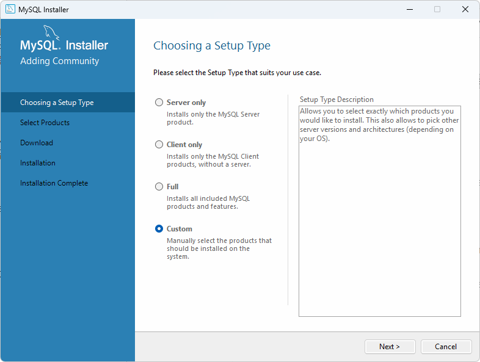
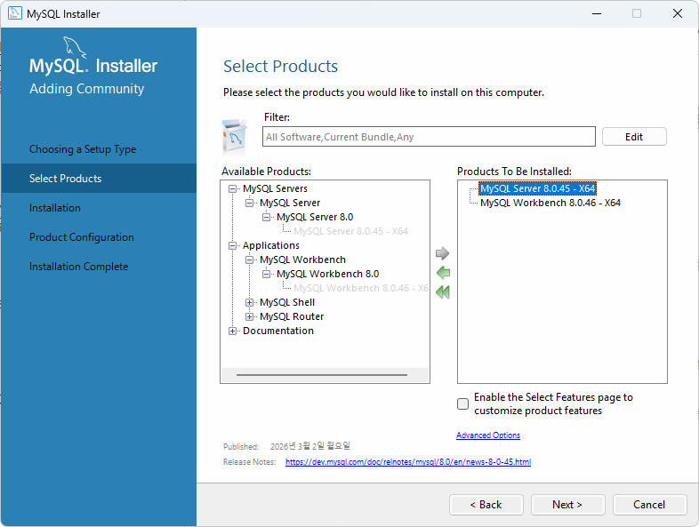
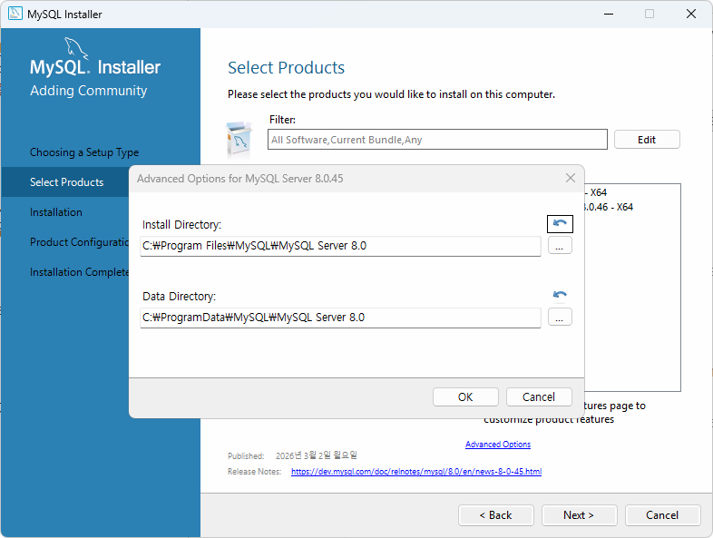
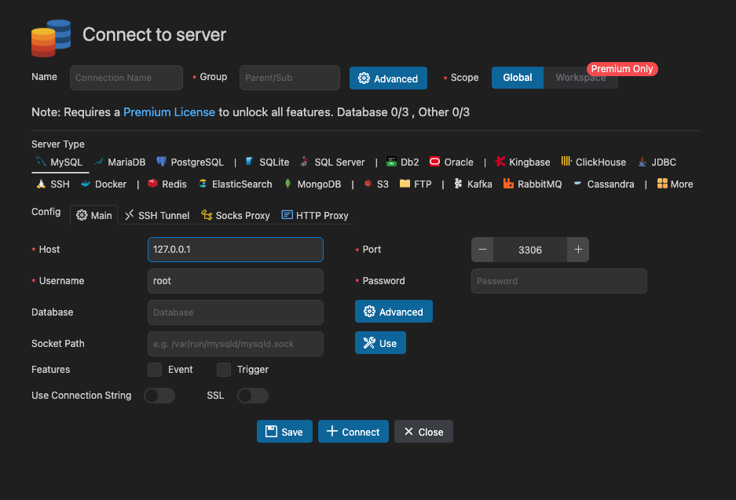
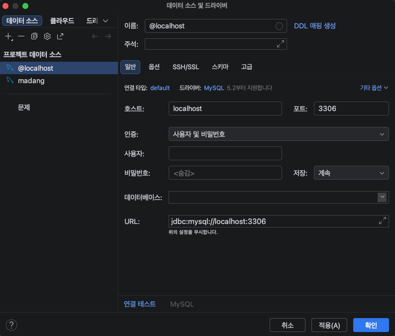

# iot-database-2026
2026년 IoT 개발자 데이터베이스 리포지토리


## 1일차

### 데이터/정보/지식

- '데이터' : 단순한 수치가 값
- '정보' : 데이터에 의미를 부여한 것
- '지식' : 정보를 통한 사물이나 현상에 대한 이해


 ### 데이터베이스

- 조직에 필요한 정보를 위해서 논리적으로 연관된 데이터를 구조적으로 통합, 저장해 놓은 것 
- **도메인** - 자기 업무에 관련된 지식
- 기업/기관은 자기 도메인 정보만 저장
- 보통 CS(client - server) 프로그램이라고 명칭, DB쪽이 서버, 프로그램쪽이 클라이언트


#### 데이터베이스 개념, 특징

- 통합 데이터 - 데이터 중복 최소화 , 중복으로 인한 테이터 **불일치 현상 제거**
- 저장 데이터 - 문서가 아닌 컴퓨터 저장장치에 저장, 반영구적 저장
- 운영 데이터 - 저장된 상태에서 **업무를 위해 사용**, 검색, 수정 등
- 공용 데이터 - 여러 사람이 업무를 위해서 **공동으로 사용**


#### 특징

- 실시간 접근성 - 수 초내 결과가 리턴
- 계속적 변화 - 추가, 수정, 조회, 삭제가 가능
- 동시 공유 - 여러 사용자가 동시에 공유, 같은 데이터를 사용하더라도 최대한 문제가 없게 처리
- 내용에 따른 참조 - 물리적인 저장 데이터가 아닌 데이터 값을 참조


#### DBMS

- 데이터베이스를 관리하는 시스템 DataBase Management System의 약자
- DBMS를 DB로 보통 통칭함


#### DBMS 장점 
- **데이터 중복최소화**, 데이터 일관성, 데이터 독립성, 관리기능(백업, 복구, **동시성제어**, 보안), 개발 생산성, **데이터 무결성 유지**, 데이터 표준 준수....


### 데이터베이스 설치(윈도우 기준)


#### 로컬에 설치
1. https://www.mysql.com/ 사이트
2. My SQL Community Edition 아래 링크 클릭
3. My SQL Installer for Windows 링크 클릭
4. MySQL Installer 8.0.45, Windows(x86, 32-bit) 다운로드
5. 다운받은 프로그램 실행




#### 도커에 설치

- Docker - 애플리케이션 신속구축, 테스팅, 서비스할 수 있는 컨테이너 기반의 오픈소스 가상화 플랫폼
  - 온라인 상에서 이미지를 다운로드(pull)
  - 실행하는 컨테이너로 만듬(run)

1. 도커 설치
   1. 도커 데스크탑 다운로드
   2. 다운로드한 설치 파일 실행
   3. wsl 업데이트 및 설치 후 재실행
2. 도커 콘솔 명령어
   ```
   - docker 
   - docker --version
   - docker search 이미지명
   - docker pull 이미지명
   - docker run ...
   - docker ps : 실행 중인 컨테이너 확인
   - docker exec - 도커 컨테이너 내부 접속
   ```

3. MySQL 설치
    - 파워쉘 켜기
    - docker search 는 도커 허브를 검색
    - docker search mysql
    - docker pull 이미지 다운
    - docker pull mysql:8.0.45
    - 명령어 입력(기존에 mysql 설치되어 있어서 포트3307로 변경함)
    -  docker run -d --name mysql80 -p 3306:3306 -e MYSQL_ROOT_PASSWORD=my123456 -e MYSQL_DATABASE=mydb -e MYSQL_USER=myuser -e MYSQL_PASSWORD=my123456 -v mysql80_data:/var/lib/mysql --restart unless-stopped mysql:8.0.45
    -  윈도우에서 설치할때 \로 줄넘김이 불가능함
    -  옵션 설명
       -  --name mysql80 : 컨테이너 이름
       -  -p 3307:3306 -> 앞에3307은 도커랑 로컬이랑 연결한 포트 뒤에 3306은 도커 컨테이너 내부에서 쓰는 포트
       -  MYSQL_ROOT_PASSWORD : 관리자 root 계정 비밀번호 초기화
       -  MYSQL_DATABASE : 컨테이너 실행시 자동 생성되는 db
       -  MYSQL_USER=myuser -e MYSQL_PASSWORD=my123456 : 일반 사용자 계정 설정
       -  mysql80_data:/var/lib/mysql: 컨테이너에서 mysql 데이터 저장 위치
       -  --restart unless-stopped: 도커 재시작 할경우 자동으로 복구


- 현재 생성 db
  - id : root, madang, myuser
  - password : my123456

1. MySQL Workbench 설치
    - Database 개발툴
    - 로컬에서 다운로드한 mysql 설치 프로그램 실행
2. vscode DB 확장 설치
    - 확장 > database 검색
    - database client 설치
    - 
3. datagrip 설치(따로 설치함)
    - datagrip 검색
    - 홈페이지에서 설치
    - 


7. 대문자로 자동 변경
    - sql 설정에서 자동변경 설정하여 대분자로 자동 변경됨

### 기본이론

#### 관계형 데이터베이스
- relational database
  - 1969년 E.F.Codd 수학 모델에 근간해서 고안
  - 테이블을 최소단위로 구성
  - 각 테이블간 관계를 통해서 데이터 모델 구성


#### 데이터베이스 종류
- 관계형 데이터베이스
  - Oracle, SQL Server(MS), MySQL(Oracle), MariaDB, PostgreSQL(오픈소스)
- NoSQL 데이터베이스
  - MongoDB, Redis, Apache, Cassandra,
- In-memory 데이터베이스
  - SAP HANA...


#### SQL
- Structured Query Language
  - 구조화된 질의 언어
  - 데이터베이스에서 데이터를 조작하고, 테이블과 같은 객체를 컨트롤하는 등의 작업을 수행하는 프로그래밍 언어
  
- SQL 종류
  - DML - 데이터 조작 언어. SELECT, INSERT, UPDATE, DELETE 와 같은 데이터를 조작하는 언어
  - DDL - 데이터 정의어. CREATE, ALTER, RENAME, DROP 같은 객체(데이터베이스 , 테이블, 사용자, 뷰, 인덱스,..)를 처리하는 언어
  - DCL - 데이터 제어어. GRANT, REVOKE 와 같이 사용자에게 권한을 주고 해제하는 기능을 처리하는 언어.
  - TCL - 트랜잭션 제어어. BEGIN TRAN, COMMIT, ROLLBACK 같은 트랜잭션 처리로 동시성 제어를 위한 언어.


### SELECT 실습

- 기본문법
    ```sql
    -- 기본 조회 궈치, * 전부라는 뜻
    SELECT *
        FROM 테이블명;
    -- 컬럼 명시할 때
    SELECT 열1, 열2 ... 열n
        FROM 테이블명;

    -- 조건 필터링(필요한 행, 레코드)만 조회할 때
    SELECT *|열이름 나열
        FROM 테이블명
    WHERE 조건....;

    -- 정렬하고 싶을 때
    -- ASCending(오름차순), DESCending(내림차순)
    -- ASC는 기본이기 때문에 생략이 가능하다
    SELECT *| 열이름 나열
        FROM 테이블 명
    WHERE 조건
    ORDER BY 열1, 열2 ASC|DESC
    ```
    


## 2일차

### 도커 사용하는 이유
- 설치 편의성 - 이미지만 존재하면 트러블 발생시 빠른 재실행이 가능(설치설정을 명령어로 한 번에 가능)
- 환경격차 문제 해결 - os단의 설정까지 건드려야하는 문제를 업애고, 간단하게 서비스를 실행 가능
- 서버비용 절감 - 새로운 서비스를 위해 새로운 서버를 구매하는 대신, 컨테이너를 돌려 한 컴퓨터에서 해결가능
- OS에 독립적 - 새로운 서비스의 운영OS에 따라 OS를 새로 설치할 필요없음
- 가상머신보다 빠름 - vmware, utm 같은 가상머신들 보다 실행속도가 빠름


### PostgreSQL 학습
- DB 시장에서 Oralce, MySQl, SQLServer 다음 PostgreSQL이 4위
- AI시대에 더 비중이 오름
- 나중에 학습할 것


### SELECT 실습
- 기본문법

```sql
SELECT ALL|DISTINCT 컬럼1, ...
  FROM 테이블명 
  WHERE 필터링 조건
  GROUP BY 컬럼1, 컬럼2...
  HAVING 집계함수 필터링 조건
  ORDER BY 정렬 조건
```


- WHERE 절 - 전체 테이터에서 필요한 것만 필터링
  - 비교 : =(같다), <>(같지 않다), != (DB 종류별로), < , >, <=, >=
  - 범위 : price BETWEEN 10000 AND 20000 (이하 이상만 가능 초과 미만은 불가능)
  - 집합 : IN, NOT IN
    - price IN (10000, 20000, 25000) -- 가격이 1만, 2만, 2만5천에 속하는 데이터
    - price NOT IN (10000, 20000) -- 가격이 1만, 2만을 제외한 데이터
  - 패턴 : LIKE (문자열만), %, _
    - bookname LIKE '축구%' -- 책 제목중 축구로 시작하는 책을 모두 지칭함
  - NULL : 데이터가 없는 것, 입력되지 않은 것, = 로 비교하지 않음 
    - price IS NULL, price IS NOT NULL 이런 식으로 사용
  - 복합 : AND(C++ &&와 동일), OR(C++ |||), NOT(C++ !)로 비교를 조합
    - (price < 20000) AND (bookname LIKE '축구의%')


- ORDER BY - 정렬 ASC(오름차순), DESC(내림차순)

- Alias - 별명으로 컬럼명, 테이블 명 등 원래의 이름을 바꿔쓰고 싶을 때 as사용
  - 쌍따옴표로 별명을 지정하는 것이 좋음
- GROUP BY, 집계함수  - DB를 사용하는 가장 큰 목적 중 하나
- HAVING - 일반 필터링은 where 절로, 집계함수 필터링은 having절로 수행함

- GROUP BY, HAVING 주의사항
  - select -> from -> where -> group by -> having -> order by 순으로 써야함
    - having 사용하려면 무조건 앞에 그룹바이가 존재해야함
    - 집계함수 외 일반컬럼은 SELECT와 GROUP BY를 일치시킬 것
    - HAVING 절에는 집계함수 필터링을 사용해야함
    - WHERE 절에 집계함수 사용불가


