# iot-database-2026
2026년 IoT 개발자 데이터베이스 리포지토리


## 1일차

### 데이터/정보/지식

- `데이터` : 단순한 수치가 값
- `정보` : 데이터에 의미를 부여한 것
- `지식` : 정보를 통한 사물이나 현상에 대한 이해


 ### 데이터베이스

- 조직에 필요한 정보를 위해서 논리적으로 연관된 데이터를 구조적으로 통합, 저장해 놓은 것 
- `도메인` - 자기 업무에 관련된 지식
- 기업/기관은 자기 도메인 정보만 저장
- 보통 CS(client - server) 프로그램이라고 명칭, DB쪽이 서버, 프로그램쪽이 클라이언트


#### 데이터베이스 개념, 특징

- 통합 데이터 - 데이터 중복 최소화 , 중복으로 인한 테이터 `불일치 현상 제거`
- 저장 데이터 - 문서가 아닌 컴퓨터 저장장치에 저장, 반영구적 저장
- 운영 데이터 - 저장된 상태에서 `업무를 위해 사용`, 검색, 수정 등
- 공용 데이터 - 여러 사람이 업무를 위해서 `공동으로 사용`


#### 특징

- 실시간 접근성 - 수 초내 결과가 리턴
- 계속적 변화 - 추가, 수정, 조회, 삭제가 가능
- 동시 공유 - 여러 사용자가 동시에 공유, 같은 데이터를 사용하더라도 최대한 문제가 없게 처리
- 내용에 따른 참조 - 물리적인 저장 데이터가 아닌 데이터 값을 참조


#### DBMS

- 데이터베이스를 관리하는 시스템 DataBase Management System의 약자
- DBMS를 DB로 보통 통칭함


#### DBMS 장점 
- `데이터 중복최소화`, 데이터 일관성, 데이터 독립성, 관리기능(백업, 복구, `동시성제어, 보안`), 개발 생산성, `데이터 무결성 유지`, 데이터 표준 준수....


### 데이터베이스 설치(윈도우 기준)


#### 로컬에 설치
1. https://www.mysql.com/ 사이트
2. My SQL Community Edition 아래 링크 클릭
3. My SQL Installer for Windows 링크 클릭
4. MySQL Installer 8.0.45, Windows(x86, 32-bit) 다운로드
5. 다운받은 프로그램 실행


#### 도커에 설치

- Docker - 애플리케이션 신속구축, 테스팅, 서비스할 수 있는 컨테이너 기반의 오픈소스 가상화 플랫폼
  - 온라인 상에서 이미지를 다운로드(pull)
  - 실행하는 컨테이너로 만듬(run)

1. 도커 설치
   1. 도커 데스크탑 다운로드
   2. 다운로드한 설치 파일 실행
   3. wsl 업데이트 및 설치 후 재실행
2. 도커 콘솔 명령어
   ```
   - docker 
   - docker --version
   - docker search 이미지명
   - docker pull 이미지명
   - docker run ...
   - docker ps : 실행 중인 컨테이너 확인
   - docker exec - 도커 컨테이너 내부 접속
   ```

3. MySQL 설치
    - 파워쉘 켜기
    - docker search 는 도커 허브를 검색
    - docker search mysql
    - docker pull 이미지 다운
    - docker pull mysql:8.0.45
    - 명령어 입력(기존에 mysql 설치되어 있어서 포트3307로 변경함)
    -  docker run -d --name mysql80 -p 3306:3306 -e MYSQL_ROOT_PASSWORD=my123456 -e MYSQL_DATABASE=mydb -e MYSQL_USER=myuser -e MYSQL_PASSWORD=my123456 -v mysql80_data:/var/lib/mysql --restart unless-stopped mysql:8.0.45
    -  윈도우에서 설치할때 \로 줄넘김이 불가능함
    -  옵션 설명
       -  --name mysql80 : 컨테이너 이름
       -  -p 3307:3306 -> 앞에3307은 도커랑 로컬이랑 연결한 포트 뒤에 3306은 도커 컨테이너 내부에서 쓰는 포트
       -  MYSQL_ROOT_PASSWORD : 관리자 root 계정 비밀번호 초기화
       -  MYSQL_DATABASE : 컨테이너 실행시 자동 생성되는 db
       -  MYSQL_USER=myuser -e MYSQL_PASSWORD=my123456 : 일반 사용자 계정 설정
       -  mysql80_data:/var/lib/mysql: 컨테이너에서 mysql 데이터 저장 위치
       -  --restart unless-stopped: 도커 재시작 할경우 자동으로 복구


- 현재 생성 db
  - id : root, madang, myuser
  - password : my123456

1. MySQL Workbench 설치
    - Database 개발툴
    - 로컬에서 다운로드한 mysql 설치 프로그램 실행
2. vscode DB 확장 설치
    - 확장 > database 검색
    - database client 설치
    - 
3. datagrip 설치(따로 설치함)
    - datagrip 검색
    - 홈페이지에서 설치
    - 


7. 대문자로 자동 변경
    - sql 설정에서 자동변경 설정하여 대분자로 자동 변경됨

### 기본이론

#### 관계형 데이터베이스
- relational database
  - 1969년 E.F.Codd 수학 모델에 근간해서 고안
  - 테이블을 최소단위로 구성
  - 각 테이블간 관계를 통해서 데이터 모델 구성


#### 데이터베이스 종류
- 관계형 데이터베이스
  - Oracle, SQL Server(MS), MySQL(Oracle), MariaDB, PostgreSQL(오픈소스)
- NoSQL 데이터베이스
  - MongoDB, Redis, Apache, Cassandra,
- In-memory 데이터베이스
  - SAP HANA...


#### SQL
- Structured Query Language
  - 구조화된 질의 언어
  - 데이터베이스에서 데이터를 조작하고, 테이블과 같은 객체를 컨트롤하는 등의 작업을 수행하는 프로그래밍 언어
  
- SQL 종류
  - DML - 데이터 조작 언어. SELECT, INSERT, UPDATE, DELETE 와 같은 데이터를 조작하는 언어
  - DDL - 데이터 정의어. CREATE, ALTER, RENAME, DROP 같은 객체(데이터베이스 , 테이블, 사용자, 뷰, 인덱스,..)를 처리하는 언어
  - DCL - 데이터 제어어. GRANT, REVOKE 와 같이 사용자에게 권한을 주고 해제하는 기능을 처리하는 언어.
  - TCL - 트랜잭션 제어어 - strat transaction, COMMIT, ROLLBACK, savepoint 같은 트랜잭션 처리로 동시성 제어를 위한 언어.


#### SELECT 실습

- 기본문법
    ```sql
    -- 기본 조회 궈치, * 전부라는 뜻
    SELECT *
        FROM 테이블명;
    -- 컬럼 명시할 때
    SELECT 열1, 열2 ... 열n
        FROM 테이블명;

    -- 조건 필터링(필요한 행, 레코드)만 조회할 때
    SELECT *|열이름 나열
        FROM 테이블명
    WHERE 조건....;

    -- 정렬하고 싶을 때
    -- ASCending(오름차순), DESCending(내림차순)
    -- ASC는 기본이기 때문에 생략이 가능하다
    SELECT *| 컬럼명 나열
        FROM 테이블 명
    WHERE 조건
    ORDER BY 컬럼1, 컬럼2 ASC|DESC
    ```
    


## 2일차

### 도커 사용하는 이유
- 설치 편의성 - 이미지만 존재하면 트러블 발생시 빠른 재실행이 가능(설치설정을 명령어로 한 번에 가능)
- 환경격차 문제 해결 - os단의 설정까지 건드려야하는 문제를 업애고, 간단하게 서비스를 실행 가능
- 서버비용 절감 - 새로운 서비스를 위해 새로운 서버를 구매하는 대신, 컨테이너를 돌려 한 컴퓨터에서 해결가능
- OS에 독립적 - 새로운 서비스의 운영OS에 따라 OS를 새로 설치할 필요없음
- 가상머신보다 빠름 - vmware, utm 같은 가상머신들 보다 실행속도가 빠름


### PostgreSQL 학습
- DB 시장에서 Oralce, MySQl, SQLServer 다음 PostgreSQL이 4위
- AI시대에 더 비중이 오름
- 나중에 학습할 것


### SELECT 실습
- 기본문법

```sql
SELECT ALL|DISTINCT 컬럼1, ...
  FROM 테이블명 
  WHERE 필터링 조건
  GROUP BY 컬럼1, 컬럼2...
  HAVING 집계함수 필터링 조건
  ORDER BY 정렬 조건
```

### 필터링
- WHERE 절 - 전체 테이터에서 필요한 것만 필터링
  - 비교 : =(같다), <>(같지 않다), != (DB 종류별로), < , >, <=, >=
  - 범위 : price BETWEEN 10000 AND 20000 (이하 이상만 가능 초과 미만은 불가능)
  - 집합 : IN, NOT IN
    - price IN (10000, 20000, 25000) -- 가격이 1만, 2만, 2만5천에 속하는 데이터
    - price NOT IN (10000, 20000) -- 가격이 1만, 2만을 제외한 데이터
  - 패턴 : LIKE (문자열만), %, _
    - bookname LIKE '축구%' -- 책 제목중 축구로 시작하는 책을 모두 지칭함
  - NULL : 데이터가 없는 것, 입력되지 않은 것, = 로 비교하지 않음 
    - price IS NULL, price IS NOT NULL 이런 식으로 사용
  - 복합 : AND(C++ &&와 동일), OR(C++ |||), NOT(C++ !)로 비교를 조합
    - (price < 20000) AND (bookname LIKE '축구의%')


- ORDER BY - 정렬 ASC(오름차순), DESC(내림차순)
  - sum - 합
  - count - 총 개수
  - min - 최소값
  - max - 최대값
  - avg - 평균
  - std - 표준편차

- Alias - 별명으로 컬럼명, 테이블 명 등 원래의 이름을 바꿔쓰고 싶을 때 as사용
  - 쌍따옴표로 별명을 지정하는 것이 좋음
- GROUP BY, 집계함수  - DB를 사용하는 가장 큰 목적 중 하나
- HAVING - 일반 필터링은 where 절로, 집계함수 필터링은 having절로 수행함

- GROUP BY, HAVING 주의사항
  - SELECT -> FROM -> WHERE -> GROUP BY -> HAVING -> ORDER BY 순으로 써야함
    - having 사용하려면 무조건 앞에 그룹바이가 존재해야함
    - 집계함수 외 일반컬럼은 SELECT와 GROUP BY를 일치시킬 것
    - HAVING 절에는 집계함수 필터링을 사용해야함
    - WHERE 절에 집계함수 사용불가

### JOIN
- JOIN - 관계형 DB의 핵심기능
  - 두 개 이상의 테이블을 합쳐서 하나의 테이블처럼 보여주는 기법

- JOIN 종류
  - INNER JOIN - 조인 중에서 가장 간단한 조인 컬럼이 일치하는 데이터만 조회
  - OUTER JOIN - 한 테이블 기준으로 데이터가 일치하지 않는 데이터까지 나오도록 조회하는 조인
    - LEFT OUTER JOIN - 두 개의 테이블 중 앞쪽 테이블 기준
    - RIGHT OUTER JOIN - 두 개의 테이블 중 뒤쪽 테이블 기준


### 서브쿼리(부속질의)
- SubQuery - 쿼리 내부에 포함되는 하위쿼리, 항상 소괄호() 내에 작성
  - 서브쿼리는 괄호안의 쿼리부터 먼저 작성
  - 메인쿼리 - 소괄호 밖의 쿼리
  - 서브쿼리 - 소괄호 안의 쿼리
  - 대부분이 조인으로 변경 가능
  - 조인이 가지고 있는 성능 개선의 특징을 사용 못하기 때문에 속도저학 발생함
  - 조인을 많이 사용한다면, 서브쿼리는 필요할때만 사용
  


## 3일차
### SELECT 실습
- DB 기본타입 - 문자열, 숫자, 날짜시간
- 
#### 서브쿼리 계속 - [쿼리](<database/day3/1. 서브쿼리.sql>)
- 서브쿼리 종류
  - WHERE절 서브쿼리
  - FROM절 서브쿼리
  - SELECT절 서브쿼리
#### 집합연산 - [쿼리](<database/day3/2. 집합.sql>)
- 두 테이블 합치기
  - UNION - 중복제거 합집합
  - UNION ALL - 중복포함 합집합
#### GROUP BY 추가 기능 - [쿼리](<database/day3/3. ROLLUP.sql>)
- ROLLUP - 모든 행을 합산한 결과를 새로운 행에 표시함


#### DML 기타 - [쿼리](<database/day3/4. DML.sql>)
- DML 중 직접적인 트랜잭션 영향을 받지 않는 것은 SELECT 뿐임
#### INSERT
- 테이블에 데이터를 삽입하는 쿼리
- 트랜잭션의 영향을 받음
```sql
INSERT INTO 테이블명 (컬럼1, ...컬럼n)
VALUES (컬럼1값, ..., 컬럼n값);   
```
- UPDATE나 DELETE와 달리 큰 문제가 발생하지 않음
- 잘못 입력하면 지우면 됨
- 
#### UPDATE
- 테이블에 존재하는 데이터를 수정하는 쿼리
- 트랜잭션의 영향을 받음
```sql
UPDATE 테이블명
  SET 변경 컬럼1 = 변경값1,
      변경컬럼2 = 변경값2,
      ...
  WHERE 구분컬럼 = 구분값;
```
#### DELETE
- 테이블에 존재하는 데이터를 삭제하는 쿼리
- 트랜잭션의 영향을 받음
- 삭제는 매우 신중

```sql
DELETE FROM 테이블명
WHERE 구분컬럼 = 구분값;
```


#### 트랜잭션 처리
- UPDATE, DELETE, (INSERT포함) 처리 오류가 발생하면 복구할 수 있는 기능 존재 
- 8장에서 다룰 예정


### DDL - [쿼리](database/day3/5.DDL.sql)
- DDL - data definition language
- 객체 생성하고 수정, 삭제하는 기능을 하는 SQL 언어


#### MYSQL 데이터타입
- `BOOL` - true/false
- `TINYINT`, SMALLINT - 1byte(255개), 2byte
  - `TINYINT(1)` - 1/0
- `INT` - 4byte(가장기본)
- FLOAT - 4byte
- DOUBLE - 8byte
- `BIGINT` - 8byte
- `DECIMAL(m,n)` - m : 전체65자리 , n : 소수점 최대자리수 30자리
  - 정수가 35자리, 소수점이 30자리인 아주 큰 수
- DATE - 날짜만 2026-03-17
- `DATETIME` - 날짜와 시간 모두 표시
- CHAR(n) - 고정길이 문자열 n만큼 길이 지정
  - char(10)에 'hello'입력하면 'hello     '로 저장
  - 나머지를 스페이스로 채움
  - 주민번호, 공통코드처럼 정확한 길이 입력이 필요한 경우 사용
- VARCHAR(n) - 가변길이 문자열 n만큼 길이 지정
  - varchar(10)은 'hello'로 저장 
- `TEXT`, LONGTEXT - 아주 긴 문자열, 2~4gb
- `BLOB` - 바이너리로 저장되는 큰 데이터, 2~4gb

#### CREATE
- db객체를 생성하는 쿼리
- 데이터베이스, 테이블, 뷰 인덱스 등 주요 객체를 생성
```sql
CREATE TABLE 테이블명(
  컬럼 1이름 데이터 타입 제약조건,
  컬럼 2이름 데이터 타입 제약조건,
  ...
  컬럼 N이름 데이터 타입 제약조건,
  [각 제약조건을 독리적으로 작성]
)
-- DB 생성
CREATE DATABASE 데이터베이스명;
-- 사용자 생성
CREATE USER 사용자명 IDENTIFIED BY 비번;
```


## 4일차

### 데이터베이스 연습 자료 
- insert into 대량 삽입 - mysql 방법
```sql
insert into 테이블명 values (컬럼1값... 컬럼n값),
(컬럼1값... 컬럼n값),
(컬럼1값... 컬럼n값),
```
- https://dev.mysql.com/doc/index-other.html?ref=dbwriter.io
- https://www.mysqltutorial.org/getting-started-with-mysql/mysql-sample-database/


`sakila` 
  - 스키마 : [쿼리](database/day4/sakila-schema.sql)
  - DB : [쿼리](database/day4/sakila-data.sql)

### DDL 계속


#### 제약조건
- 데이터베이스에 정확한 데이터가 들어갈 수 있도록, 테이블 각 컬럼별 입력가능한 데이터를 지정하는 것
- 종류: 기본키(primary key), 단일(unique),널 허용 여부(null), 체크(check), 기본값(default), 외래키(foreign key)


#### create 계속 [쿼리](database/day4/2.CREATE.sql)
- create 구문
  - primary key (컬럼1 또는 여러개)
  - foreign key (custid) references NewCustomer(custid) on delete cascade
    - references : 참조하는 부모테이블과 pk 컬럼
    - on delete cascade : 부모가 삭제될 경우 자식도 같이 삭제함
    - on delete set null : 부모 테이블의 pk 값이 삭제되면, 자식 테이블의 fk 값은 null로 변경한다.
    - on update cascade | set null : 부모 테이블의 기본 키(Primary Key) 값이 변경되면, 해당 값을 참조하고 있는 자식 테이블의 외래 키 값도 자동으로 동일하게 변경 | 부모 테이블의 값이 변경되면, 자식 테이블의 관련 외래 키 값을 NULL로 변경합니다. 
- AUTO_INCREMENT : 테이블에 데이터 삽입할때 숫자타입 pk의 값을 자동으로 증가시켜서 만들어주는 기능
  - pk컬럼은 insert 문에서 생략
  
#### ALTER [쿼리](database/day4/3.ALTER.sql)
- alter 
  - 객체 수정, 테이블 이외에서 많이 사용 안됨
```sql
alter table 테이블명
  [add 속성명 데이터타입]
  [drop column 속성명]
  [modify 속성명 데이터타입]
  [modify 속성명 [null|not null]]
  [add primary key(컬럼명)]
  [[add|drop] 제약조건명]
```


#### DROP [쿼리](database/day4/3.ALTER.sql)
- drop
  - 객체 삭제
  - 테이블에서 관계를 맺고 있는 자식테이블을 먼저 삭제해야 부모테이블을 삭제할 수 있다.
  ```sql
  drop 객체 객체명
  ```

### 내장함수 [쿼리](database/day4/4.내장함수.sql)

- c, c++ 내장함수와 동일

### NULL [쿼리](database/day4/5.NULL.sql)
- 아직 지정되지 않은 값
- '0', '', ' ' 과 다름 
- c, c++ 의 '0\' 과 동일한 의미 
- 비교 연산 불가
- IS, IS NOT 만 사용 가능
- NULL 값을 연산하면 결과도 NULL이 됨
  - NULL + 숫자 => NULL
  - 집계함수 계산시 NULL 포함된 행은 집계에서 자동 제외됨
  
### 쿼리연습
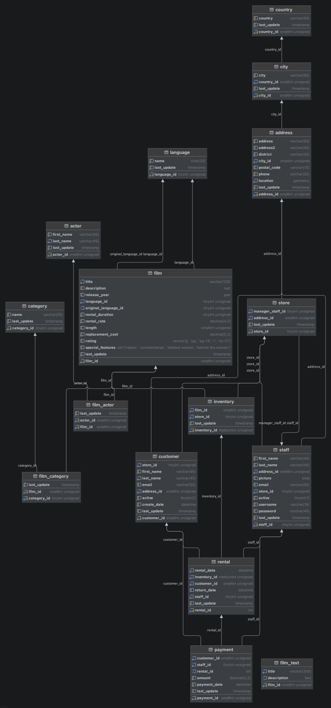
[쿼리](database/day4/7.Sakila_practice.sql)


## 5일차
### 쿼리연습 [쿼리](database/day5/1.sakila_practice.sql)


### 뷰 [쿼리](database/day5/2.뷰.sql)
- view
  - 편리성과 재사용성 : 일반 테이블 사요ㅕㅇ하는 것처럼 사용하고, 여러번 사용가능
  - 보안성 : 개인정보와 같은 민감한 데이터의 공개를 막을 수 있음
  - 독립성 : 일반 테이블처럼 사용, 사용자가 필요한 정보만 가공
- 뷰 특성
  - 실제 데이터가 아님, 원본데이터가 변경된다면 뷰 데이터도 갱신됨
  - 독립적인 인덱스 생성이 어려움(속도개선이 어려움)
  - insert, update, delete는 거의 불가능
  - 위가 가능하려면 단일테이블로 뷰를 만들어야함(그럼 원본에 영향이감)

  ```sql
  -- 생성과 수정
  create or replace view 뷰이름 as
  select 구문;

  -- 삭제 
  drop view 뷰이름;
  ```
### 인덱스 [쿼리](database/day5/3.인덱스.sql)
- INDEX
  - 책뒤편 찾아보기, 인덱스와 동일한 역할
  - 테이블에 하나이상 설정가능(인덱스를 건다라고 부름)
  - 인덱스가 없으면 FULL TABLE SCAN, 인덱스가 있으면 INDEX RANGE SCAN으로 변경 
  - 내부적으로 b-tree 자료구조 사용, $O(logN)$
  ```sql
  -- 인덱스 생성
  create index 인덱스명
  on 테이블명(컬럼명)

  -- 인덱스 삭제
  drop index 인덱스명 on 테이블명;
  ```
- 인덱스 종류
  - 기본키 인덱스 : Primary키에 자동으로 걸리는 인덱스
  - UNIQUE 인덱스 : UNIQUE 제약조건 컬럼에 걸 수 있는 인덱스, NULL은 허용하지만 데이터 중복은 불가능
  - 일반 인덱스 : 중복허용, 인덱스 효과가 미흡
  - 복합 인덱스 : 두개 이상의 컬럼을 하나의 인덱스로
- 인덱스 구분
  - 클러스터 인덱스 : 테이블당 하나만 생성, 데이터 자체가 정렬되는것, 최초 pk나 pk가 없는 테이블에서는 첫번째  UNIQUE 인덱스
  - 넌클러스터 인덱스 : 여러개 가능, 인덱스랑 데이터가 따로 생성됨, 클러스터 인덱스 생성 후 모든 인덱스가 전부 넌클러스터 인덱스로 생성됨
- 인덱스 주의사항
  - 인덱스를 생성한다고 무조건 속도가 빨라지는 것은 아님.
  - where절에 자주 사용되는 컬럼에 인덱스를 걸어야 함(pk에 자동으로 인덱스 생성)
  - join에 사용되는 fk에도 인덱스를 걸면 속도 개선
  - 단일 테이블에 인덱스를 너무 많이 걸면 반대로 속도가 느려짐
  - 인덱스마다 asc, desc로 정렬해야하기 때문에 부가적인 처리가 많아짐
  - 자주변경, 삭제되는 컬럼에 인덱스를 걸지 말것
  - 중복이 많이 되거나, NULL이 많은 컬럼은 인덱스 효과 미비

### SELECT문 추가 기능
#### CTE [쿼리](database/day5/4.CTE.sql)
- Commin table expression : 공통으로 쓸 수 있는 테이블 표현 기법
  - 여러곳에서 공통으로 사용할 임시 테이블 형태 쿼리
  - 이름을 지정하는 임시 테이블
  - 쿼리를 깔끔하게 생성
  - 쿼리 실행동안 재사용
  - 가상데이터를 생성할때 
  ```sql
  with cte 이름 as(
    select...
  )
  select *
  from cte 이름
  ```


## 6일차

### 트랜잭션, 동시성제어
- TCL
  - Transaction Control Language에 포함된 start transaction, commit, roolback, savepoint

#### Transaction
- 트랜잭션
  - 일을 처리하는 논리적인 단위 그룹
  - 여러 쿼리들이 실행되어 완성되는 하나의 논리그룹 처리 단위

- 트랜잭션 4가지 특징(ACID)
  - 원자성(Atomicity) : 전부 성공하거나 전부 실패(All or Nothing)
  - 일관성(consistency): 거래 전후로 데이터 규칙이 유지됨
  - 격리성(Isolation): 여러사람이 동시에 처리해도 서로 영향이 없음
  - 지속성(Durability): 성공한 처리는 절대 사라지지 않음

- db툴 설정에서 오토 커밋 끄기
  - set autocommit = 0;
  - 아니면 툴 자체 설정에서 해제하기
  - 데이터그립의 경우 파일 상단에 있음
  - 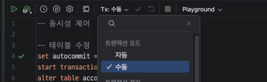

#### 트랜잭션 쿼리 [쿼리](<database/day6/1. 트랜잭션.sql>)
- 기본
    ```sql
    start transaction; -- 트랜잭션 시작
    -- 쿼리들 실행
    commit; -- 모두 저장, 완벽하게 동작하는 경우만 커밋 실행
    rollback; -- 커밋 직전 상태로 돌아감
    ```
- 세이브포인트
  ```sql
  start transaction;
  savepoint p1; -- 세이브포인트 설정해서 사용
    -- 쿼리들 실행
  rollback to p1; -- 세이브포인트 시점으로 이동 세이브 포인트 이후 실행한 쿼리들은 모두 초기화됨 
  ```

#### 동시성제어 [쿼리](database/day6/2.동시성제어.sql)
- 개요
  - 여러 트랜잭션이나 프로세스가 동시에 실행될때 데이터의 일관성을 유지하면서 처리하는 것 
  - lock, isolation level, mvcc 등 동시성 제어기법 사용


  - 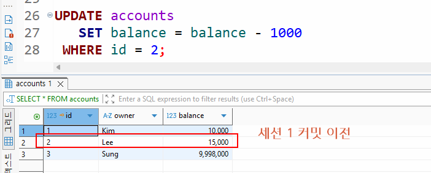
  - 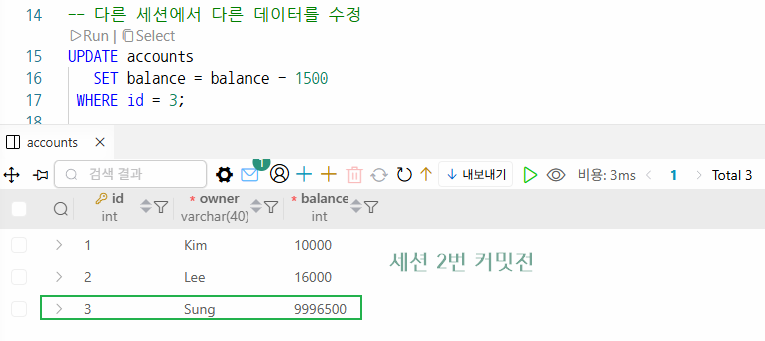


- 행 단위 락 - 일반적인 락 
  - 세션 1번이 특정 데이터의 트랜잭션을 종료하지 않으면
  - 세션 2번은 데이터를 update, delete할 수 없음 
- 락 걸린상태
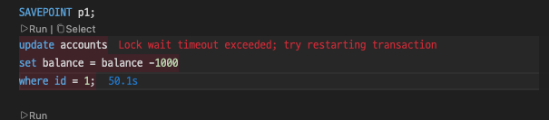
  - 서로 다른 행의 데이터는 접근가능함


- 격리수준 - 동시에 여러 트랜잭션이 실행될 때 서로의 데이터에 얼마나 영향을 줄지 제어하는 기준
  - 최하 - read uncommitted - 커밋되지 않은 데이터 읽을 수 있음(사용안함)
    - set session transaction isolation level read committed 로 실행함
  - 중간 - read committed - 커밋된 데이터만 읽음
  - 기본 - rpeatable read - mysql 기본값, 같은 트랜잭션 안에서는 항상 같은 결과
  - 최고수준 - serializable  - 순차적 실행, 동시성없음, 안전하지만 성능 최악
  - 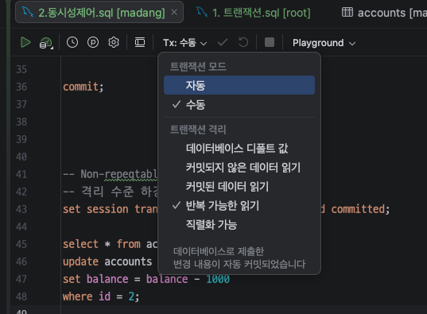


- 동시성 제어 문제 
  - Dirty Read - 다른 트랜잭션이 아직 커밋하지 않은 데이터를 읽는 현상


  - Non-repeqtable Read - 같은 트랜잭션 안에서 같은 데이터를 두번 읽었을때 결과가 다른 현상
  - Phantom Read - 같은 조건으로 두 번 조회시 행 개수가 달라지는 현상 

- 격리수준과 동시성 제어 정리
  |격리수준|Dirty Read|Non-repeqtable Read|Phantom Read|
  |:--:|:--:|:--:|:--:|
  |read uncomitted|방지|가능|가능|
  |repeatable read|방지|가능|일부 방지|
  |serializable|방지|방지|방지|

- 데드락
  - mysql은 데드락이 오래 걸리지 않도록 50초 후 데드락을 풀어버림
  - 트랜잭션이 종료된 것은 아니므로 따로 커밋, 롤백을 수행해야함
  - 트랜잭션을 짧게 유지 할 것.


- 테이블락
  - 테이블 전체를 락
  - commit rollback 과 관계없이 언락을 해줘야 다른 트랜잭션에서 접근 가능 함

### 보안 및 관리


### 사용자 [쿼리](database/day6/3.user_grant.sql)
- 사용자 생성 및 삭제 
  - 데이터베이스를 사용할 계정을 생성 쿼리, DDL
  - 생성 삭제는 root 계정에서만 가능함
  ```sql
  -- 사용자 생성
  create user '사용자명'@'local.host|%' identified by '비밀번호';

  -- 사용자 삭제
  drop user '사용자명'

  -- 사용자 비밀번호 변경
  alter user 'hugo'@'%' identified by 'my123456';
  ```

### 권한
- DCL - 사용자에게 권한을 설정
  - 대부분 관리자가 수행함
  - grant, revoke
  ```sql
  -- 권한 부여
  grant all privileges on 데이터베이스.* to 'hugo'@'%';

  -- 특정 권한 부여
  grant select, insert, update on 데이터베이스.* to 'hugo'@'%';
  
  -- 권한 제거
  revoke all privileges on 데이터베이스.* from 'hugo'@'%';

  ```

#### mysql 백업 복구
- dump, restore
  - *.sql 파일로 내보내기
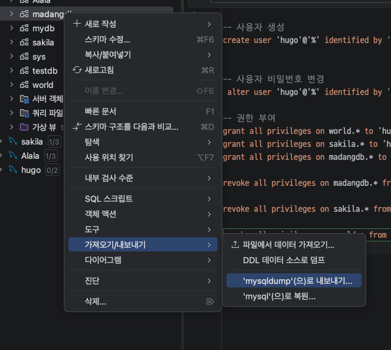

### MySQL 프로그래밍
#### 데이터베이스 프로그래밍
- 각 db마다 프로그래밍 언어가 상이
  - Oracle : 'PL/SQL'
  - SQL Server : T-SQL
  - MySQL : MySQL Programming
- 일반 프로그래밍 언어와 차이점 존재
  - DB 전용 프로그램 개발
- mysql의 경우 함수 안정성 체크옵션으로 생성불가 발생
  - 관리자에서 실행


#### 사용자 정의 함수 [쿼리](database/day6/4.함수.sql)
- 내장함수에 없는 기능의 함수를 추가로 개발하는 것
- 함수 파라미터, 리턴값이 존재
- 일반 쿼리문에 포함가능


## 7일차
### MySQL 프로그래밍 
#### 저장 프로시저 [쿼리](database/day7/1.저장프로시저.sql)
- 저장 프로시저
  - 함수와 달리 리턴값이 없음
  - 일반 쿼리문에 포함 불가능 
  - 단독 실행 또는 배치(스케줄에 따라) 실행
  - 사용자가 없는 새벽에 대량처리 수행할 때
  - 쿼리 콘솔에 작성 후 실행 

#### 커서 [쿼리](database/day7/2.커서.sql)
- Cursor
  - 마우스 커서와 동일하게 테이블의 한 위치를 가리키는 객체
  - 데이블의 데이터를 한 행씩 처리하기 위해서 사용
  - cursor, open, fetch, close

#### 트리거 [쿼리](database/day7/3.트리거.sql)
- trigger
  - 방아쇠를 뜻함 하나의 테이블에서 insert, update, delete 문이 실행되면 다른 테이블이나 다른 처리가 자동으로 실행되는 저장 프로그램 중 하나
  - before 트리거 보다 after 트리거가 많이 사용됨
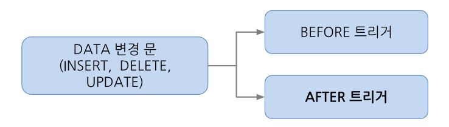
### c/c++ MySQL 연동[쿼리](database/day7/c++/test_cpp_db/main.cpp)
- 개발방법
  - MySQL 서버
  - MySQL Connector
  - visual studio 프로젝트 생성 
  - c++ 코드 작성

#### MySQL Connector/C++ 라이브러리
- https://dev.mysql.com/downloads/file/?id=549083
  - 위 링크에서 자기 os에 맞는 버전 설치
- cmake에서 사용시 cmakelist 파일에 해당 내용 추가 필요
```
cmake_minimum_required(VERSION 3.20)
project(test_cpp_db) # 본인 프로젝트 이름으로 수정

set(CMAKE_CXX_STANDARD 17)

# 1. 확인하신 커넥터의 최상위 경로 설정
set(MYSQL_BASE_DIR "/usr/local/mysql-connector-c++-8.4")

# 2. 헤더 파일 경로 (include와 jdbc 폴더를 모두 포함)
include_directories("${MYSQL_BASE_DIR}/include")
include_directories("${MYSQL_BASE_DIR}/include/jdbc")

# 3. 라이브러리(.dylib) 경로
link_directories("${MYSQL_BASE_DIR}/lib64")

add_executable(${PROJECT_NAME} main.cpp)

# 4. JDBC용 라이브러리 링크 (mysqlcppconn)
target_link_libraries(${PROJECT_NAME} PRIVATE mysqlcppconn)

# 5. macOS 실행 시 라이브러리 위치를 찾을 수 있게 설정 (매우 중요)
set_target_properties(${PROJECT_NAME} PROPERTIES
        INSTALL_RPATH "${MYSQL_BASE_DIR}/lib64"
        BUILD_WITH_INSTALL_RPATH TRUE
)
```


### 데이터베이스 모델링

#### 모델링
- 개요
  - 현실세계에 존재하는 시스템을 컴퓨터 시스템으로 변환하기 위한 디자인
  - 현실세계의 데이터를 DB상에 입력해서 프로그램에서 사용할 수 있도록 설계
  - 예. 오프라인 매장 -> 온라인 매장, 시립도서관 -> 온라인 시립 도서관, 백화점 -> 모바일 백화점
- 데이터베이스 생성주기
  - 요구사항 수집 및 분석 > 설계 > 구현 > 운영> 감시 및 개선

- sw 생명주기
  - db생명주기 설계와 구현이 sw생명주기 설계에 속함
  - 요구사항 수집 및 분석 > 설계 > 구현 > 테스트 > 배포 > 유지보수/관리


- db 설계의 순서
  1. 개념 모델링 : 요구사항에 따른 개념적인 모델링으로, 추상적인 도형으로 관계 구성 
       - 각 테이블이 될 엔티티 추출
       - 전체적인 뼈대를 만드는 과정 
       - 테이블의 컬럼이 될 속성 추출
       - 속성 구분자가 될 키 추출

  2. 논리 모델링 : 개념 모델링 바탕으로 속성, 키, 관계 명확히정의 
        - 데이터 중복을 최소화 하는 정규화 수행
        - 관계형 데이터 모델 테이블화 , 구체화
  3. 물리 모델링
        - 실제 db 종류를 고려해서 설계
        - 테이블, 컬럼, 인덱스, 제약조건, 뷰 등 객체들 생성, 성능을 위해 반정규화 진행
        - 최종 스키마 완성
        - 실제 데이터베이스화


## 8일차
### 데이터베이스 모델링
#### ERD
- Entity Relationship Diagram
#### ER 모델
- 데이터베이스 설계 과정에서 데이터 간의 구조와 관계를 개념적으로 설계하기 위해 사용하는 도구
- 구성 요소
  - 개체 - 현실 세계의 유무형 정보(사각형)
  - 속성 - 개체가 가진 고유의 특성이나 성질(타원)
  - 관계 - 개체와 개체간의 연관성(마름모)

  1. 속성(Attribute)의 종류
    - 기본속성 - 개체를 유일하게 식별할 수 있는 키(Key) 속성 (타원 안의 텍스트에 밑줄)
    - 복합속성 - 주소(시, 구, 동)처럼 독립적인 속성으로 분해할 수 있는 속성
    - 다중값속성 - 전화번호처럼 하나의 개체가 여러 값을 가질 수 있는 속성 (이중 타원)
    - 유도속성 - 생년월일로부터 계산된 '나이'처럼 다른 속성으로부터 계산되어 나오는 속성 (점선 타원)
  2. 관계(Relationship)의 특성
    - 개체들 사이의 대응 관계를 나타냄 핵심은 카디널리티(Cardinality)
    - 카디널리티의 종류
      - 1:1 관계: 한 개체가 다른 개체 하나와만 연결됨 (예: 사용자 - 프로필)
      - 1:N 관계: 한 개체가 여러 개의 다른 개체와 연결됨 (예: 부서 - 사원)
      - N:M 관계: 여러 개체가 여러 개의 다른 개체와 서로 연결됨 (예: 학생 - 과목) 실제 DB 구현 시에는 연결 테이블을 통해 1:N으로 분해

  - 여기까지 개념 ER모델이지만, 현재는 논리 ER모델과 통합해서 작성하고 있음. IE표기법

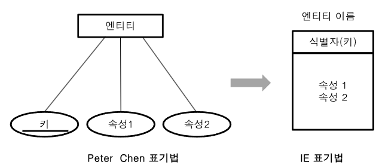
#### ERD 설계 + 정규화 실습 [쿼리](database/day8/1.ERD.sql)
- 학원 수강관리 시스템 
  - 학생의 학원에서의 해당 강사에게 속한 과목을 수강신청하는 시스템 DB 설계
- 요구사항 분석
  - 학생정보, 강사정보, 과목정보, 수강신청정보
  - 학생은 여러 과목을 수강할 수 있음
  - 한 과목은 한 명의 강사가 담당함
  - 학생의 수강신청일과 성적도 관리함
- 학원 엑셀에서 관리하던 정보 -> db 시스템화 

| 학번   | 학생명 | 전화번호          | 과목코드 | 과목명    | 강사명 | 강사전화          | 신청일        | 성적 |
| ---- | --- | ------------- | ---- | ------ | --- | ------------- | ---------- | -- |
| 1001 | 김철수 | 010-1111-1111 | C101 | C언어    | 이민호 | 010-9999-1111 | 2026-03-01 | A  |
| 1001 | 김철수 | 010-1111-1111 | P201 | Python | 박지은 | 010-9999-2222 | 2026-03-02 | B  |
| 1002 | 이영희 | 010-2222-2222 | P201 | Python | 박지은 | 010-9999-2222 | 2026-03-03 | A  |


- 수강관리 시스템화 되기 이전 문제점
  - 이상현상
    - 삽입이상 : 수강생이 없는 새 과목은 추가가 어렵다(과목, 강사면,  강사전화만 입력하면 의미있는 데이터가 아님)
    - 수정이상 : 박지은 강사의 전화번호가 바뀌면 Python 과목을 듣는 모든 행을 찾아서 수정해야함
    - 삭제이상 : 특정학생의 과목신청 내용을 삭제하면 과목정보, 강사정보 모두 사라질 수 있음
- 정규화 
  - 이상현상, 종속성문제, 이행성 문제 등을 제거하는 작업
  - 아래 와 같은 테이블 이 존재함

- 제1정규형(1NF)
  - 도메인(속성값)이 원자값이어야 함, 한 컬럼에 여러값이 들어가면 안됨
  - 전화번호 컬럼에 두개의 값이 들어가면 안됨(수강과목 - 과학,수학)
 


- 제2정규형(2NF)
  - 기본키의 일부에만 종속되는 컬럼은 제거함 : 부분적 함수 종족 제거
  - 학생명, 전화번호 속성은 학번에만 종속 -> 학생 정보 분리
  - 과목명, 강사명, 강사전화는 과목코드에만 종속 -> 강사정보, 과목정보  
  - 신청일, 성적은(학번, 과목코드) 속성에 포함
  - 학생 테이블

    | 학번 (PK) | 학생명 | 전화번호 |
    | :--- | :--- | :--- |
    | 1001 | 김철수 | 010-1111-1111 |
    | 1002 | 이영희 | 010-2222-2222 |
  - 과목테이블
    | 과목코드 (PK) | 과목명 | 강사명 | 강사전화 |
    | :--- | :--- | :--- | :--- |
    | C101 | C언어 | 이민호 | 010-9999-1111 |
    | P201 | Python | 박지은 | 010-9999-2222 |
  - 수강테이블
    | 학번 (FK/PK) | 과목코드 (FK/PK) | 신청일 | 성적 |
    | :--- | :--- | :--- | :--- |
    | 1001 | C101 | 2026-03-01 | A |
    | 1001 | P201 | 2026-03-02 | B |
    | 1002 | P201 | 2026-03-03 | A |
- 일반적으로 3정규형까지 완료하고 ERD를 작성, 2정규형 결과 후에 ERD 작성도함

- 제3정규형(3NF)
  - 이행적 종속성 : A -> B, B-> C 면 A -> C다 
  - 과목/강사정보 : 과목코드 -> 과목명, 과목코드 -> 강사명, 강사명 -> 강사전화
  - 과목코드로 강사명을 알 수 있고 강사명으로 강사전화를 알 수 있음
  - 과목정보가 강사정보를 끌고 다님
  - 과목정보, 강사정보로 분리 : 이행적 종속성 제거
  - 강사정보를 구분지을 키 속성이 생성되어야 함
  - 학생 테이블(student)
    | 학번 (PK) | 학생명 | 전화번호 |
    | :--- | :--- | :--- |
    | 1001 | 김철수 | 010-1111-1111 |
    | 1002 | 이영희 | 010-2222-2222 |

  - 수강테이블(Enrollment)
    | 학번 (FK/PK) | 과목코드 (FK/PK) | 신청일 | 성적 |
    | :--- | :--- | :--- | :--- |
    | 1001 | C101 | 2026-03-01 | A |
    | 1001 | P201 | 2026-03-02 | B |
    | 1002 | P201 | 2026-03-03 | A |
  - 과목테이블(Lecture)
    | 과목코드 (PK) | 과목명 | 강사코드(FK) |
    | :--- | :--- | :--- |
    | C101 | C언어 | 123 |
    | P201 | Python | 456 |
  - 강사테이블(Instructor)
    | 강사코드 (PK) | 강사명 | 강사전화 |
    | :---:| :---: | :---: |
    | 123 | 이민호 | 010-9999-1111 |
    | 456 | 박지은 | 010-9999-2222 |

  - 제3정규형이 적용된 개념ERD
    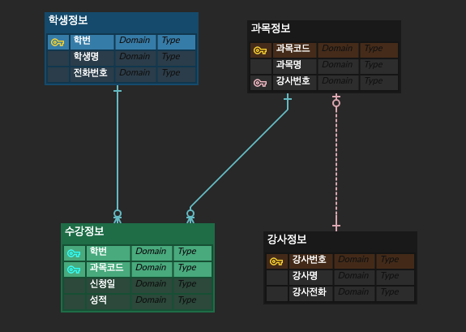
  - 논리 ERD 작성
    - 각컬럼에 데이터 형식 지정
    - 도메인에 들어갈 데이터 특정
    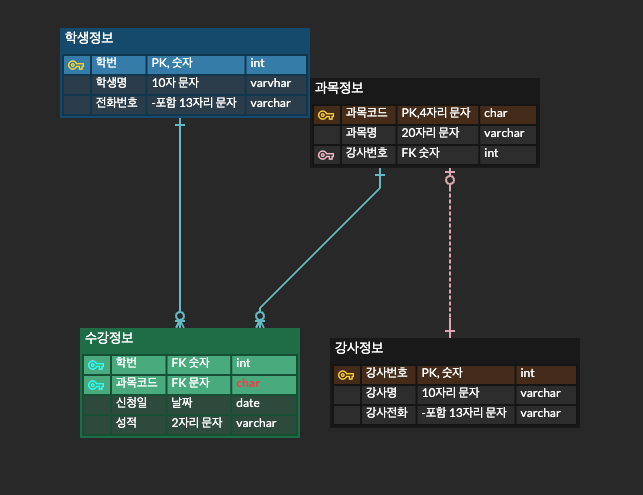


  - 물리 ERD 작성
    - DB종류에 따른 데이터 타입 특정
    - 관련 뷰, 인덱스 등 추가 객체 처리(ERDCloud에서는 불가능)
    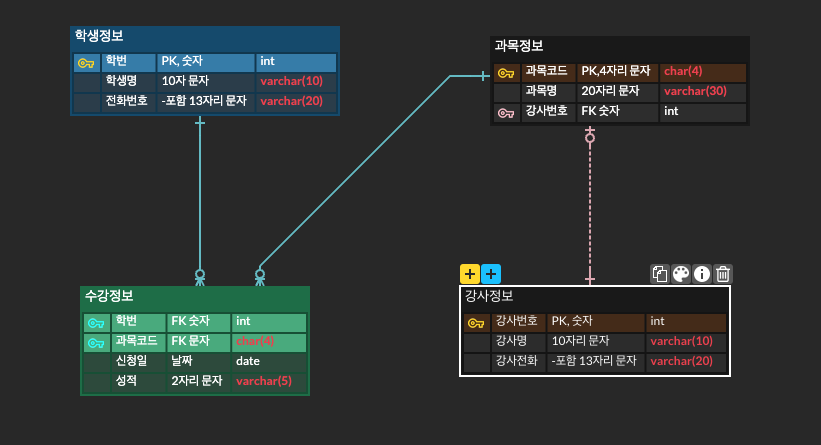
    - 제약 추가한 버전
    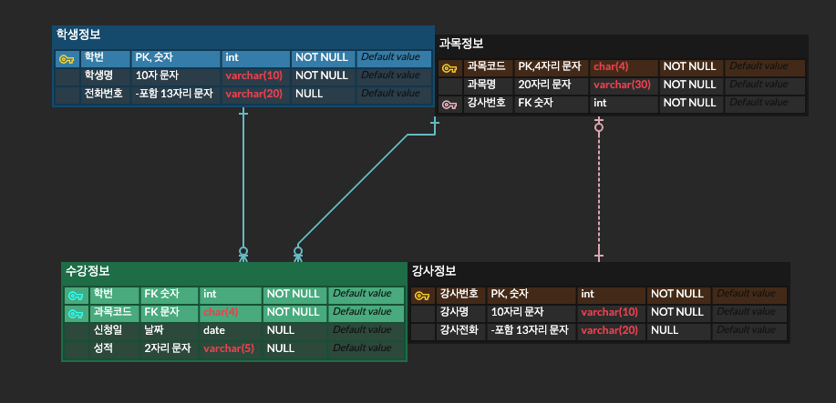

  -  MySQL 데이터베이스, 사용자 직접 생성
     -  학원이름(부경 it아카데미, pkit, academy)
     -  학원 수강신청 시스템(institude enrollment system) -> pa-ies -> PAIES DB명 선정완료
  - NULL과 NOT NULL 비교
   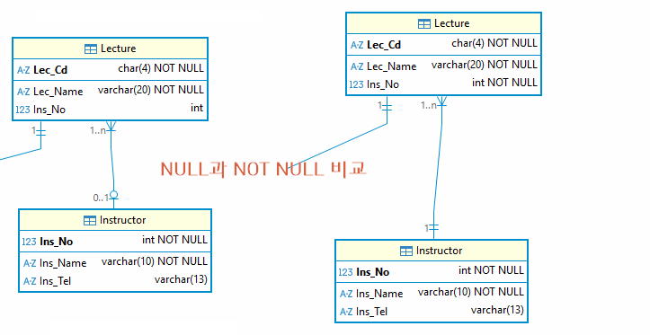
  - 강사정보 테이블 ins_no 가 NULL과 NOT NULL 사이의 관계 비교
  - 왼쪽은 강사번호 없어도 입력 가능, 오른쪽은 강사번호 입력 필수


- BCNF(boyce-codd 정규형)
  - 모든 함수 종속 x -> y 에서 x는 반드시 유일한 결정자가 되어야함 pk를 제대로 결정하라
  - 키 종류 : 기본키, 외래키, 복합키(두 개의 속성이 기본키 구성), 후보키, 슈포키
  - 후보키 : 슈퍼키(기본키)가 될 수 있는 속성들
  - 슈퍼키 : 행을 유일하게 식별할 수 있는 속성 집합(한 개 또는 여러개) 유일하기만 하면 됨

  |학생 |과목|강사|
  | -- | --| --|
  |A | C언어| 김교수|
  |B | C언어|김교수|
  |A| DB| 이교수|
- (학생, 과목) -> 강사는 결정가능 
- 과목만 가지고도 강사를 결정할 수 있음

- 과목-강사 분해
  |과목|강사|
  |---|---|
  |C언어|김교수|
  |DB|이교수|

- 학생 - 과목 분해
  |학생|과목|
  |---|---|
  |A|C언어|
  |B|C언어|
  |A|DB|


- 제4정규형 (4NF)
  - 다중값 종속 제거
  - 처음부터 설계가 잘못된 경우가 대부분 ERD작성시 발생경우 거의 없음

  | 학생 | 취미 | 자격증    |
  | -- | -- | ------ |
  | A  | 축구 | 정보처리기사 |
  | A  | 축구 | SQLD   |
  | A  | 독서 | 정보처리기사 |
  | A  | 독서 | SQLD   |


- 제5정규형(5NF)
  - 조인종속제거
  - 설계로 테이블 나눠도 조인을 하면 원래 데이터가 나와야 함
  - 엑셀 내용과 DB화 한 테이블 조인 후 결과가 동일함


  - 취미정보 분해

    |학생|과목|
    |---|---|
    |A|축구|
    |B|독서|

  - 자격증정보 분해

    |학생|자격증|
    |---|---|
    |A|정보처리기사|
    |B|SQLD|


  - 요약
  
    | 정규형 | 대상 (조건) | 주요 내용 및 해결 방법 |
    | :--- | :--- | :--- |
    | **제1정규형 (1NF)** | **원자값 (Atomic Value)** | 각 속성의 값은 반드시 하나여야 함. 다중 값이나 반복 그룹 제거. |
    | **제2정규형 (2NF)** | **부분 함수 종속성 제거** | 기본키가 복합키일 때, 키의 일부분에만 의존하는 속성 분리. |
    | **제3정규형 (3NF)** | **이행적 함수 종속성 제거** | 기본키가 아닌 속성 간의 종속성 제거 (A→B, B→C 관계 분리). |
    | **BCNF** | **결정자/후보키 관계** | 모든 결정자가 후보키가 되도록 설계. |
    | **제4정규형 (4NF)** | **다치 종속 제거** | 하나의 테이블에 독립적인 1:N 관계가 여러 개 섞여 있는 경우 분리. |
    | **제5정규형 (5NF)** | **조인 종속 제거** | 테이블 분해 후 다시 조인했을 때 무결성이 유지되도록 함. |

    - 정규화를 모두 진행한 뒤 DB화를 진행
    - 단, 쿼리 실행시 속도저하 발생가능 -> 반정규화


### 대량 데이터 인덱스 실습
- 100만건 이상의 데이터에서 인덱스를 제대로 설정하지 않으면 조회 쿼리시 속도 저하
- 1차적으로 인덱스 거는 작업 2차적으로 쿼리 튜닝

#### 초기설정 
- 대량데이터 실습용 테이블 orders_big
- 순번 처리용 테이블 nums
- 100만건씩 insert용 저장 프로시저 insert_big_orders [쿼리](database/day8/4.대량데이터저장프로시저.sql)
- 저장프로시저 실행 [쿼리](database/day8/5.대량삽입프로시저실행.sql)


#### 인덱스 연습 [쿼리](database/day8/6.인덱스실습.sql)
- 실행계획
  - db쿼리 최적화 분석 방법
- 실행계획 결과
```text
-> Sort: orders_big.order_date DESC  (cost=1.04e+6 rows=9.95e+6) (actual time=2790..2790 rows=26 loops=1)
    -> Filter: (orders_big.customer_id = 123456)  (cost=1.04e+6 rows=9.95e+6) (actual time=1258..2789 rows=26 loops=1)
        -> Table scan on orders_big  (cost=1.04e+6 rows=9.95e+6) (actual time=0.395..2500 rows=10e+6 loops=1)
```
- 위 내용 분석 : 제일 아래부터 해석함
  1. Table scan on orders_big : cost비용(메모리 쓰는 비용 ), rows(table scan으로 읽는 행수, 995만 정도), 0.0745초로 속도가 느리지 않음
  2. Filter: orders_big.customer_id(where절에서 필터링한 내용), actual time(현재까지 걸린시간 1+2, 3번의 actual time 은 1+2+3)시간이 1258..2789로 급격하게 증가함
  3. Sort : orders_big.order_date DESC(주문날짜 기준 내림차순 정렬) 최종시간 2790..2790

- 인덱스 추가 후
```text
/* 인덱스 추가 후 실행계획
-> Sort: orders_big.order_date DESC  (cost=28.6 rows=26) (actual time=1.97..1.97 rows=26 loops=1)
    -> Index lookup on orders_big using idx_orders_customer_id (customer_id=123456)  (cost=28.6 rows=26) (actual time=0.449..1.93 rows=26 loops=1)
*/
```


## 9일차

#### windows 라이브러리 연동
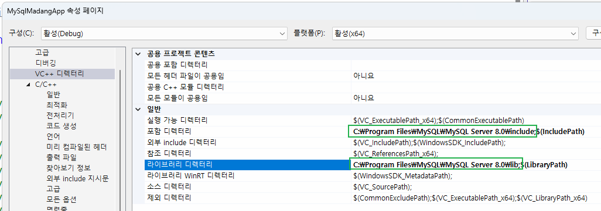
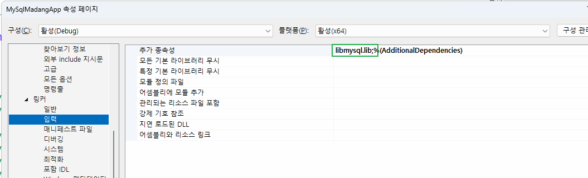 
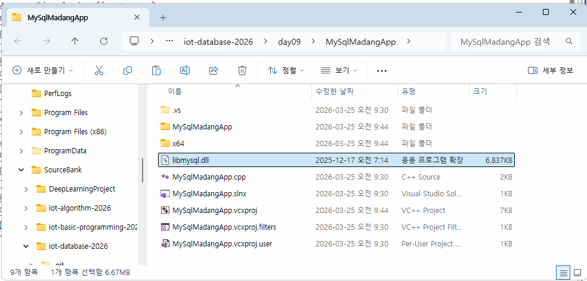 


#### C++ MySQL 연동
- 기본 연결확인 구현
- 테이블 데이터 확인 
  - 쿼리문 문자열 마지막; 무조건 제거(오류발생)
- MySQL 연동순서 
  1. 콘솔 인코딩 UTF-8 설정
  2. 연결, 행데이터, 결과 구조체 변수, 포인터 변수 선언
  3. MySQL 초기화
  4. 접속정보로 접속
  5. 서버 문자셋 UTF-8 설정
  6. 쿼리 실행
  7. 결과 메모리 저장
  8. 한 행씩 Fetch, 출력
  9. 메모리 해제
  10. 접속 종료


#### MySQL CRUD 앱 구현
- c학습 addressbook 프로젝트와 비교
  - file IO vs MySQL DB 
  - contact 구조체 vs mysql 자체 구조체 사용
  - 파일 관련 작업 vs mysql 함수로 처리

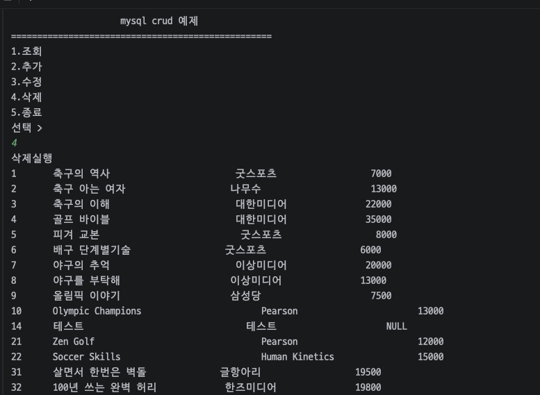

- MySQL CPP api 함수 목록
  1. 드라이버 객체 생성 - sql::mysql::MySQL_Driver *driver= sql::mysql::get_mysql_driver_instance();
  2. 연결 설정 - sql::Connection *con= driver->connect(host, user, pass);
  3. 스키마 선택 - con->setSchema(dbName);
  4. 예외처리 에러 - sql::SQLException &e
  5. 에러 코드 - e.getErrorCode();
  6. 에러 내용 - e.what();
  7. 쿼리 보내고 쿼리 내용 받아오기 - unique_ptr<sql::Statement> stmt(con->createStatement());
        unique_ptr<sql::ResultSet> res(stmt->executeQuery("SELECT * FROM Book"));
        int id = res->getInt("bookid");
            string name = res->getString("bookname");
  8. 쿼리문작성 - unique_ptr<sql::PreparedStatement> pstmt(con->prepareStatement());
  9. 작성한 쿼리문 실행 - pstmt->executeUpdate();


- MySQL Connector/c++
  - MySQL C API를 C++로 클래스화 한 라이브러리
  - 객체화, 예외처리 기능 고급화
  - 운영체제 환경에 영향을 많이 받음
  - 설정난이도가 높음
  - 유지보수하기 좋음

- MySQL C API
  - C언어 기반
  - 함수 중심임
  - 사용난이도 낮음
  - 설정난이도 낮음
  - 예외처리를 직접 해야함